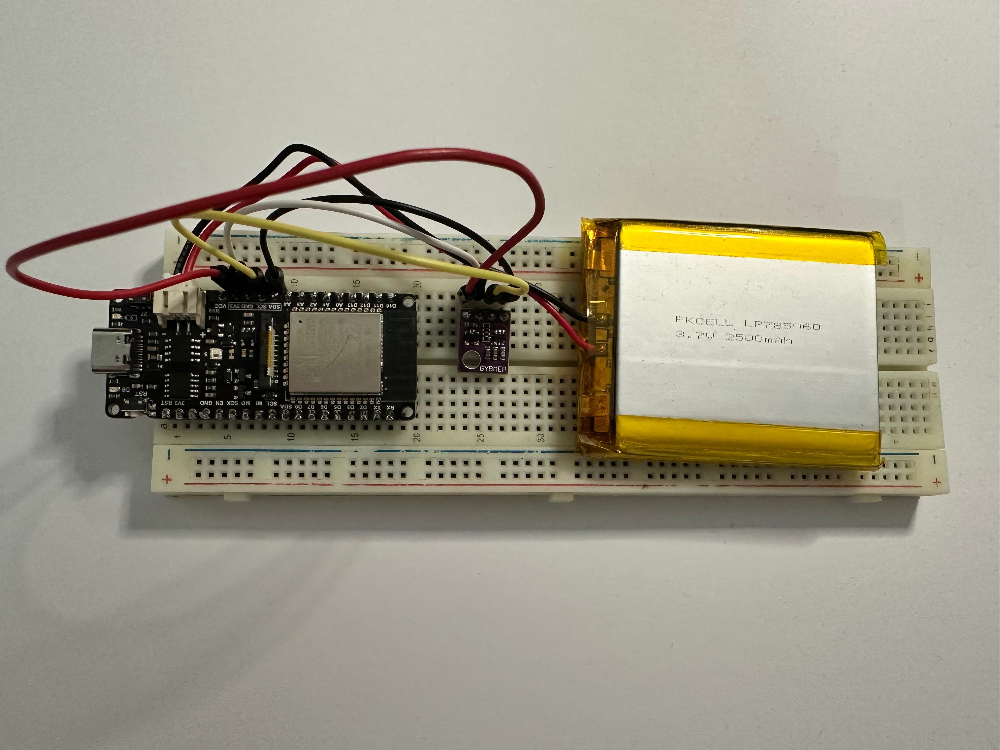

# Dashboard-ESP32

Ein End-to-End IoT-Dashboard: ein ESP32-Sensor misst Temperatur, Luftfeuchtigkeit und Luftdruck im Wohnraum, eine ASP.NET Core API nimmt die Werte entgegen und speichert sie in Postgres, und eine WPF-Desktop-App zeigt sie als Dashboard an — inklusive Verlaufs-Chart, konfigurierbarer Städteliste mit Live-Wetterdaten, automatischer Datenbereinigung und automatischem Self-Update auf Windows.

Kein Tutorial-Projekt: alle vier Ebenen (Embedded, Backend, Datenbank, Desktop-Client) laufen produktiv im 15-Minuten-Takt, inklusive CI/CD auf Azure und GitHub Actions.

## Architektur

```
┌─────────────┐   HTTPS POST alle     ┌──────────────────┐   EF Core    ┌──────────────┐
│  ESP32 +    │   15 Min. (JSON)      │  ASP.NET Core 8  │  (Npgsql)    │  Postgres    │
│  BME280     ├──────────────────────▶│  Web API         ├─────────────▶│  (Neon,      │
│  (C++/      │                       │  (Azure App      │              │  serverless) │
│  PlatformIO)│                       │  Service, F1)    │              │              │
└─────────────┘                       └────────┬─────────┘              └──────────────┘
                                               │ HTTPS GET/DELETE
                                               ▼
                                       ┌──────────────────┐        ┌─────────────────────┐
                                       │  WPF-Dashboard   │───────▶│  Open-Meteo API     │
                                       │  (Windows, mit   │        │  (Städte-Wetter)    │
                                       │  Auto-Update via │        └─────────────────────┘
                                       │  Velopack)       │
                                       └──────────────────┘
```

## Komponenten

| Ordner | Was | Tech-Stack |
|---|---|---|
| `ESP32Dev/` | Firmware für den ESP32, liest BME280-Sensordaten aus und postet sie per HTTPS an die API | C++, PlatformIO, Arduino-Framework, WiFiClientSecure, ArduinoJson |
| `ASP.Net/` | REST-API (`Api`), Domänenmodell (`Core`), Datenzugriff (`Persistence`), Seed-Tool (`ConsoleFillDb`) | ASP.NET Core 8, Entity Framework Core, Npgsql |
| `WPF/` | Desktop-Dashboard mit Live-Chart, Städte-Wetter-Widget und Self-Update | .NET 8, WPF, LiveCharts2, Velopack |
| `.github/workflows/` | CI/CD: Azure-Deploy der API bei Push, Windows-Installer-Release der WPF-App bei Git-Tag | GitHub Actions |

## Features

- **Sensor-Firmware** mit robustem WLAN-Reconnect, gebundenen HTTP-Timeouts und Hardware-Watchdog (`esp_task_wdt`) — läuft dauerhaft ohne manuellen Eingriff, auch bei WLAN-Aussetzern oder blockierenden I2C-Reads.
- **Automatische Datenbereinigung**: die API löscht Messwerte, die älter als 48 Stunden sind, und kappt zusätzlich die Gesamtzeilenzahl als Sicherheitsnetz — angestoßen vom WPF-Client bei jedem Laden.
- **Konfigurierbare Städteliste** im Dashboard (bis zu 5 Städte, live editierbar) mit aktuellen Min/Max-Temperaturen über die Open-Meteo-API.
- **Self-Updating Windows-Installer**: die WPF-App prüft bei jedem Start selbstständig auf GitHub Releases nach einer neueren Version, lädt sie im Hintergrund und wendet sie beim nächsten Neustart an (Velopack) — kein manuelles Neuinstallieren nötig.
- **CI/CD**: Push auf `main` (im `ASP.Net`-Pfad) deployt die API automatisch auf Azure App Service; ein Git-Tag (`vX.Y.Z`) baut und veröffentlicht automatisch einen neuen Windows-Installer als GitHub Release.

## Lokal aufsetzen

### Sensor (ESP32 + BME280)

```bash
cd ESP32Dev
cp include/secrets.h.example include/secrets.h   # eigene WLAN-Zugangsdaten eintragen
pio run --target upload --target monitor --upload-port /dev/cu.wchusbserial1130
```


### API

```bash
cd ASP.Net/Api
# eigene Postgres-Connection-String via dotnet user-secrets oder appsettings.Development.json setzen
dotnet run
```

### WPF-Dashboard

```bash
cd WPF/Wpf
# ApiBaseUrl in appsettings.json auf die eigene API-Instanz setzen
dotnet run
```

Fertige Windows-Installer gibt es unter [Releases](../../releases) — einmal installieren, danach aktualisiert sich die App selbst.


## Roadmap

- [ ] Automatisierte Tests für API (xUnit) und WPF-ViewModels
- [ ] Angular-Web-Dashboard (gehostet auf Vercel) als Alternative zum WPF-Client, um dieselben Daten auch webbasiert zu steuern
- [ ] Nächste Sensor-Generation auf ESP32-C6
- [ ] Migration von .NET 8 auf .NET 10 (LTS) vor dem .NET-8-Support-Ende (11/2026)

## Über dieses Projekt

Ich bin Reza Jaghori. Mit diesem Projekt wollte ich mein Wissen aus Ausbildung/Studium auffrischen und vertiefen — konkret: wie IoT-Geräte in der Praxis wirklich funktionieren, vom Sensor bis zur Anzeige auf dem Bildschirm. In der Ausbildung lernt man meist einzelne Bausteine, aber selten die gesamte Entwicklungskette an einem echten, laufenden Beispiel — genau diese Lücke wollte ich für mich selbst schließen.

Gleichzeitig soll das Projekt als einfaches, nachvollziehbares Beispiel für andere dienen, die sehen möchten, wie sowas grundsätzlich geht: ein Mikrocontroller, der Daten misst und sendet, eine API, die sie entgegennimmt, eine Datenbank, die sie speichert, und eine App, die sie anzeigt — alles offen einsehbar und produktiv im Einsatz, nicht nur als Tutorial-Schnipsel.

Bewusst mit einer Architektur aufgebaut, wie man sie auch in echten Projekten findet, nicht als Wegwerf-Hobbycode: das WPF-Dashboard folgt dem MVVM-Muster (View, ViewModel, Model sauber getrennt), die API ist in Schichten aufgeteilt (`Core` für das Domänenmodell, `Persistence` für den Datenzugriff über EF Core, `Api` für die Controller), und Zugangsdaten liegen nie im Code, sondern in `secrets.h` (Sensor) bzw. User Secrets/`appsettings.json`-Overrides (API) — beides gitignored. Der Anspruch dahinter: dieses Setup soll sich in eine reale Entwicklungsumgebung übernehmen lassen, nicht nur als Hobbyprojekt in der Schublade liegen.

**Was ich dabei konkret gelernt habe / gerade lerne:**
- Robuste Embedded-Firmware schreiben: WLAN-Reconnect-Logik, HTTP-Timeouts und ein Hardware-Watchdog (`esp_task_wdt`), nachdem der Sensor stundenlang ohne ersichtlichen Grund ausgefallen ist — inklusive der Erfahrung, dass ein Reboot-Log nicht automatisch ein Crash ist, sondern manchmal die eigene Schutzlogik greift.
- Produktiv mit CI/CD arbeiten: GitHub Actions für automatisches Azure-Deployment und für automatisierte Windows-Installer-Releases (Velopack) aufsetzen, inklusive der Kleinarbeit beim Debuggen (Permissions, Tokens, Publish-Profile).
- Sauberer Umgang mit Secrets: warum Zugangsdaten nie ins Repo gehören, wie man sie nachträglich sauber rausbekommt (Git-History-Reset) und wie man sie von Anfang an richtig auslagert (`secrets.h`, User Secrets, App Settings).
- Den Unterschied zwischen "wo liegt der Fehler wirklich" und "wo sieht man ihn zuerst" — z. B. beim Debugging, ob ein Ausfall an der API, der Datenbank oder am Sensor selbst liegt.

**Warum Neon und Azure App Service:** beide haben einen brauchbaren Free-Tier, wodurch das Projekt nichts kostet. Azure passt zusätzlich gut zum .NET-Ökosystem, in dem ich mich vertiefen wollte, und Neon als serverloses Postgres passt zum Schreibmuster des Sensors — alle 15 Minuten ein Wert, dazwischen keine Last. Beides war auch bewusst gewählt, um mit genau diesen Cloud-Diensten Praxiserfahrung zu sammeln.

Ich bin auf Jobsuche als Entwickler im .NET-/C#-Umfeld, gerne mit Embedded- oder Cloud-Bezug, im Raum Linz/Steyr.

## Lizenz

Dieses Projekt ist unter der [MIT-Lizenz](LICENSE) veröffentlicht.
